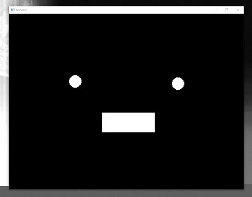
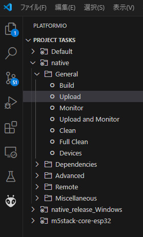

# m5stack-avatar-on-WinPC

イナバ (id:hollyhockberry)さんの記事にあった[m5stack-avatar をPC上で動かす](https://hollyhockberry.hatenablog.com/entry/2023/12/30/144823) という仕組みを元に、デスクトップ上の音量に合わせてアバターの口を開閉させてみサンプルです。



おまけでいくつかカスタムアバターも入れておきました。楽しんでいただけたら幸いです。

```
src/custom-face/**.h
```


初期状態ではこの `オリジナルのカスタムアバター` のために `ちょっと改修した版の M5Stack-Avatar (lib/m5stack-avatar-custom-u-tanick)` を利用しています。
いつものスタックチャンの顔 [・__・] だけを使う場合は、`platformio.ini` の以下のコメントアウトを外し、不要な改修版のライブラリを削除してください。

```
    コメントアウトする
    - platformio.ini
    meganetaaan/M5Stack-Avatar@^0.10.0

    削除する
    - lib/m5stack-avatar-custom-u-tanick
```


## 想定環境

- OS：Windows (10で検証済み)
- ビルド環境：VS Code & PlatformIO

## 実行手順

- PlatformIO（蟻マーク）の native > General > Upload を実行



## 音声取得の仕組み

Windows用のAPI `EndpointVolume API` の `IAudioMeterInformation` クラスの `GetPeakValue()` 関数を使用してデスクトップ上の音量を取得しています。

音量が 0 - 1 の間のfloatで取得されるため、それを `m5stack-avatar` の `avatar.setMouthOpenRatio()` にセットすることでアバターの口の開閉を行っています。

### 実装上の注意点 1

ライブラリの読み込み順序に一部制約があり、関連する以下のライブラリ群では `Windows.h` を最上位に読み込む必要があります。

``` cpp
#include <Windows.h>          // Windows API
#include <mmdeviceapi.h>      // IMMDeviceEnumerator, IMMDevice など
#include <endpointvolume.h>   // IAudioMeterInformation
#include <Audioclient.h>      // WASAPI
#include <iostream>           // std::cerr などの標準入出力
```

### 実装上の注意点 2

`platformio.ini` に記載されているビルド設定をご利用ください。

``` ini
[env:native]
[env:native]
platform = native
build_type = debug
build_flags = -O0 -xc++ -std=c++14
    -lSDL2                      ; for Display avatar
    -DM5GFX_BOARD=board_M5Stack ; for Display avatar
    -DM5GFX_SCALE=3             ; for Display avatar size
    -lmmdevapi -luuid -lole32   ; for Get Desktop Volume
lib_deps = 
    m5stack/M5Unified@^0.1.17
    meganetaaan/M5Stack-Avatar@^0.10.0
```

### 実装上の注意点 3

自分が使用したGNU（GCC）コンパイラ `MSYS2/MinGW-w64` には IAudioMeterInformation の完全な構造定義がないようです。
そのため、PortAudio リポジトリから IAudioMeterInformation の完全な定義をコピーし、必要な __CRT_UUID_DECL を追加して、コンパイル エラー「_GUID const& __mingw_uuidof への未定義の参照」を回避しています。

参考：
https://stackoverflow.com/questions/62012071/why-is-iaudiometerinformation-an-incomplete-type

`main.cpp` 中の以下のコードが上記の対処箇所です。

``` cpp
__CRT_UUID_DECL(IAudioMeterInformation, 0xC02216F6, 0x8C67, 0x4B5B, 0x9D, 0x00, 0xD0, 0x08, 0xE7, 0x3E, 0x00, 0x64);

// Define the IAudioMeterInformation interface
MIDL_INTERFACE("C02216F6-8C67-4B5B-9D00-D008E73E0064")
IAudioMeterInformation : public IUnknown
{
public:
    virtual /* [helpstring] */ HRESULT STDMETHODCALLTYPE GetPeakValue(
        /* [out] */ float *pfPeak) = 0;

    virtual /* [helpstring] */ HRESULT STDMETHODCALLTYPE GetMeteringChannelCount(
        /* [out] */ UINT *pnChannelCount) = 0;

    virtual /* [helpstring] */ HRESULT STDMETHODCALLTYPE GetChannelsPeakValues(
        /* [in] */ UINT32 u32ChannelCount,
        /* [size_is][out] */ float *afPeakValues) = 0;

    virtual /* [helpstring] */ HRESULT STDMETHODCALLTYPE QueryHardwareSupport(
        /* [out] */ DWORD *pdwHardwareSupportMask) = 0;
};
```

このコードが無い場合、 `main.cpp` 中の下記のコード中の `pMeterInfo` の個所で `不完全な型 "IAudioMeterInformation" へのポインターまたは参照は使用できません` というエラーが発生しました。

``` cpp
    float peakLevel = 0.0f;
    hr = pMeterInfo->GetPeakValue(&peakLevel);   // ここでエラー
    if (FAILED(hr)) {
        std::cerr << "音量レベルの取得に失敗しました。" << std::endl;
    }

    pMeterInfo->Release();  // ここでもエラー
    pDevice->Release();
    pEnumerator->Release();
    CoUninitialize();
```
